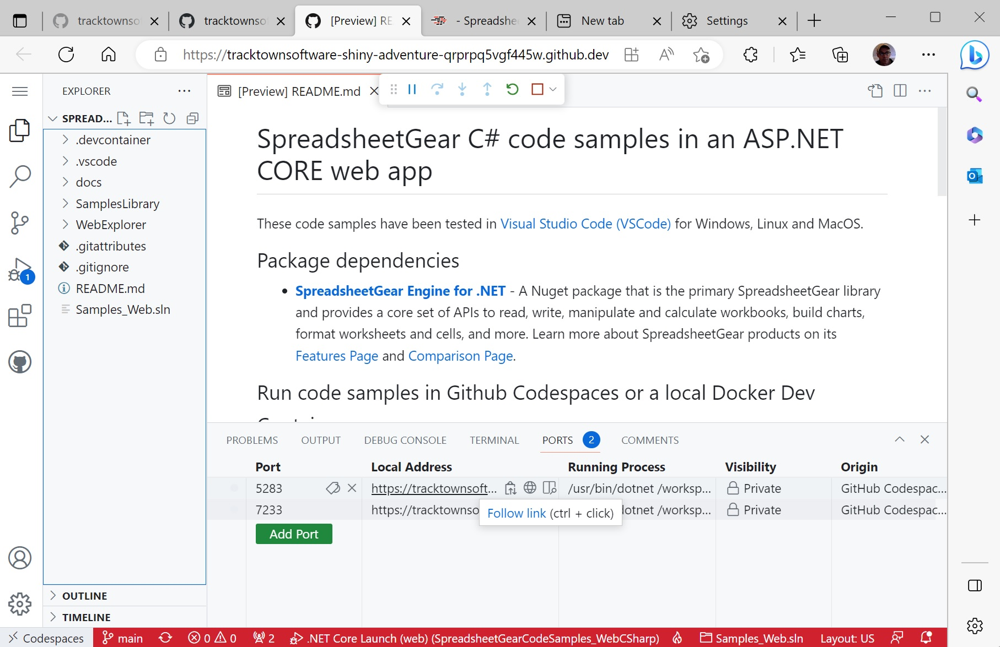

# SpreadsheetGear C# code samples in an ASP.NET CORE web app #

These code samples have been tested in [Visual Studio Code (VSCode)](https://code.visualstudio.com/) for Windows, Linux and MacOS.

## Package dependencies ##
*   **[SpreadsheetGear Engine for .NET](https://www.nuget.org/packages/SpreadsheetGear/9.1.44-beta)** - A Nuget package that is the primary SpreadsheetGear library and provides a core set of APIs to read, write, manipulate and calculate workbooks, build charts, format worksheets and cells, and more. Learn more about SpreadsheetGear products on its [Features Page](https://www.spreadsheetgear.com/Products/Features) and [Comparison Page](https://www.spreadsheetgear.com/Products/Compare).

## Run code samples in Github Codespaces ##
*Please read note about [Github Codespaces Port Forwarding](#github-codespaces-port-forwarding---use-links-in-the-vscode-terminal-window-ports-tab)*
- [Open a Github Codespace for this repo in a browser based VSCode editor (No install required)](./docs/SampleCodeInVSCode.md#open-a-github-codespace-for-this-repo-in-a-browser-based-vscode-editor-no-install-required).
- [Open a Github Codespace for this repo in your local VSCode editor (requires the VSCode extension Github Codespaces)](./docs/SampleCodeInVSCode.md#open-a-github-codespace-for-this-repo-in-your-local-vscode-editor-only-requires-the-vscode-extension-github-codespaces).

## Run code samples in a local Docker Dev Container ##
- [Clone this repo and open a local Dev Container in your VSCode editor (requires Docker Desktop and VSCode Dev Containers extension)](./docs/SampleCodeInVSCode.md#clone-this-repo-and-use-its-devcontainer-configuration-in-your-local-vscode-editor-requires-docker-desktop-and-vscode-dev-containers-extension).

## Run code samples in Visual Studio Code with all requirements installed ##

*There is no need to install this list of requirements if using Github Codespaces or a local Docker Dev Container.*

*These instructions are for SpreadsheetGear code samples in an ASP.NET CORE web app and should work for Windows, MacOS and Linux*

1. From [Download .NET](https://dotnet.microsoft.com/en-us/download)
    - Install the .NET 7.0 SDK - *Required for .NET Extension Pack for Visual Studio Code. SpreadsheetGear works with .NET SDK version 6.0 and later*
2. Install [Visual Studio Code](https://code.visualstudio.com/)
3. Install [.NET Extension Pack for Visual Studio Code](https://marketplace.visualstudio.com/items?itemName=ms-dotnettools.vscode-dotnet-pack)
    - Ignore the "Getting Started with .NET" prompt to "Install .NET SDK". You already installed it in step 1.
4. Install [Git version control](https://git-scm.com/download)
5. Clone this repo and open its local folder in VSCode.

## GitHub Codespaces Port Forwarding - Use links in the VSCode Terminal window 'PORTS' tab ##

The launchSettings.json file specifies ports https://localhost:7233 and http://localhost:5283. 

However, when running the web app in a remote Github Codespace, these ports are forwarded to URL links found in the 'PORTS' tab in the VSCode Terminal window. You need to use these links rather than the localhost links in launchSettings.json. See image below.

