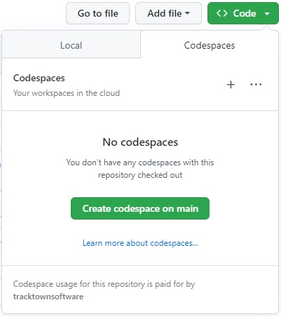
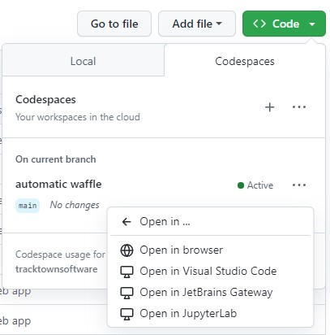
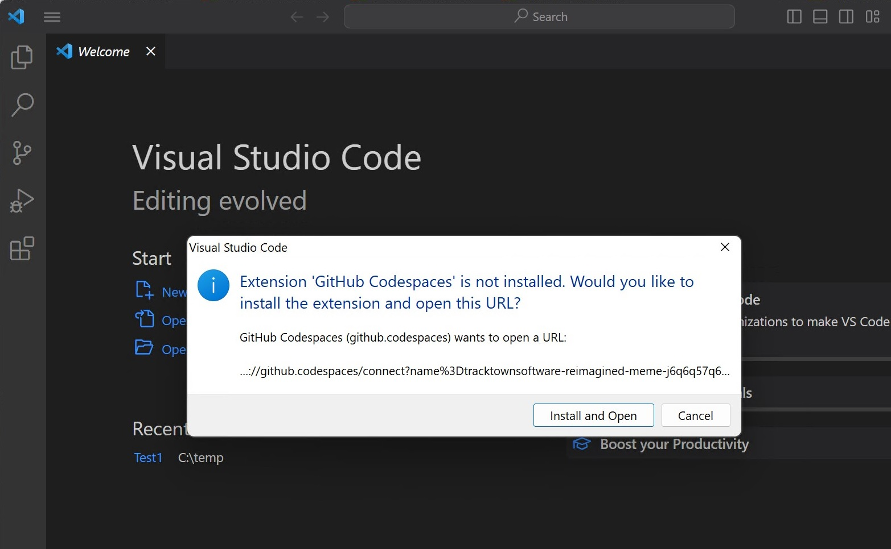
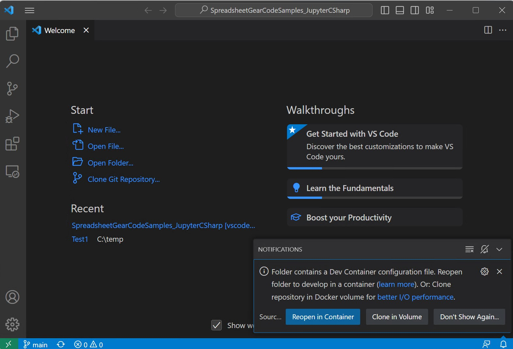

# Minimal install options to view and run SpreadsheetGear code samples in Visual Studio Code #

## Open a Github Codespace for this repo in a browser based VSCode editor (no install required) ##
1. [Github Codespaces Overview](https://docs.github.com/en/codespaces/overview)
2. Open this repository and click the green "Code" button
3. Select the Codespaces tab. If you don't see this tab (see image below), then make sure the CodeSpaces feature is enabled in your Github account settings. 
4. Click the "Create Codespaces on Main" button. Configuration information found in this repo's [.devcontainer folder](../.devcontainer) will be used to create a Docker DevContainer.

    

6. You will see your new Codespace for this repo load into a browser based Visual Studio Code editor. Wait a few more minutes as required VSCode extensions are downloaded and installed (you will not see this delay when opening an existing Codespace).
7. Github free accounts only allow you 2 free Codespaces, but you can create and delete Codespaces as needed.  

## Open a Github Codespace for this repo in your local VSCode editor (only requires the VSCode extension Github Codespaces) ##
1. Once you have an existing Github Codespace ([see previous option](#open-a-github-codespace-for-this-repo-in-a-browser-based-vscode-editor-no-install-required)), you can choose to open it in your local installed VSCode editor.

    

2. If not already installed, you will be prompted to install extension *Github Codespaces* into your local VSCode.

    

## Clone this repo and use its DevContainer configuration in your local VSCode editor (requires Docker Desktop and VSCode Dev Containers extension) ##
1. [VSCode Dev Containers Tutorial](https://code.visualstudio.com/docs/devcontainers/tutorial)
2. Install [Docker Desktop](https://docs.docker.com/get-docker/) on your local machine to host the Docker Dev Container.
3. Install the [Visual Studio Code Dev Containers](https://marketplace.visualstudio.com/items?itemName=ms-vscode-remote.remote-containers) extension
4. Clone this repo into your target folder.
5. Launch VSCode and use its "Open Folder..." to open the local folder for this repo.
6. If the VSCode Dev Container extension is installed, VSCode will detect a .devcontainer folder exists and display a notification to "Reopen in Container". Go ahead and click this button.

    

7. If you don't see the VSCode notification to "Reopen In Container", you can run the "Dev Containers: Open Folder in Container..." command from the Command Palette (F1) or quick actions Status bar item. 

    

